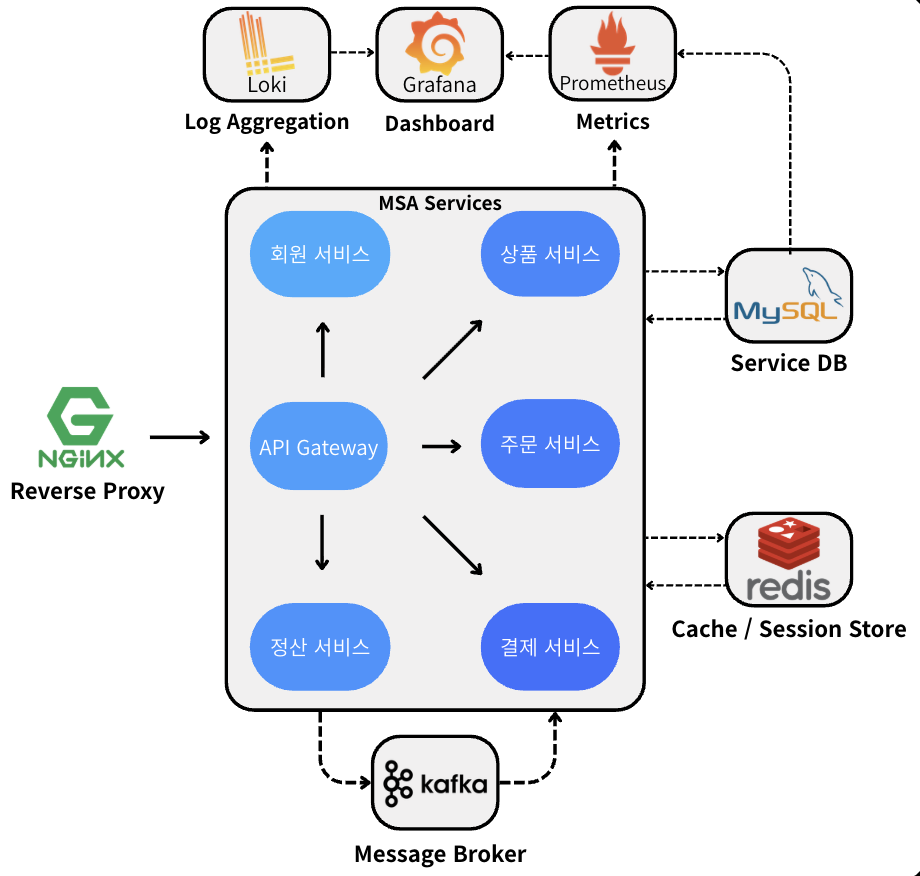
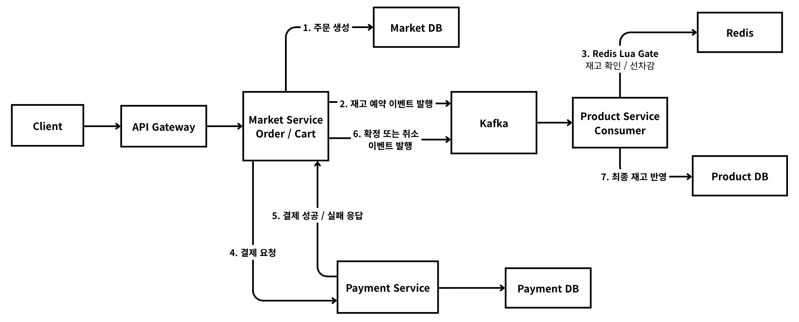
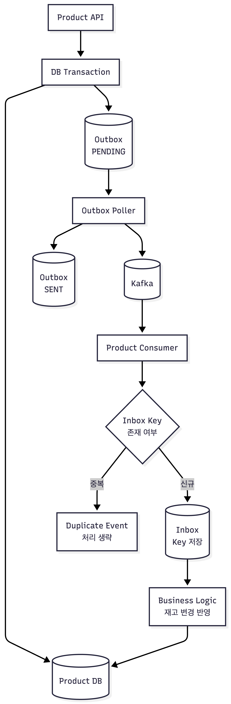
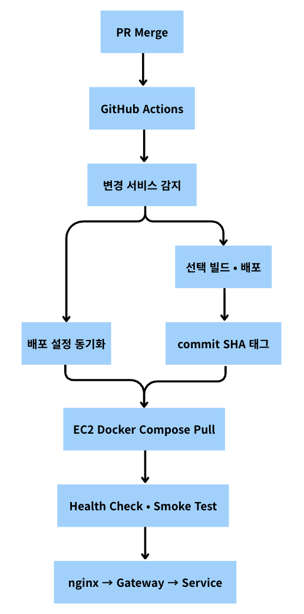

# THOCK - MSA 이커머스 백엔드

THOCK은 키보드 상품을 판매하는 이커머스 백엔드 프로젝트입니다.

초기에는 4인 팀으로 MSA 기반 이커머스의 배포, 인증, 회원, 상품, 주문, 결제, 정산 흐름을 구축했습니다.
팀 프로젝트 종료 후에는 전체 코드베이스를 이어받아 상품·재고·주문 핵심 거래 흐름을 중심으로 이벤트 신뢰성, 데이터 정합성, 장애 전파 제어, 조회 성능을 개인적으로 고도화했습니다.

초기 팀 프로젝트 원본 레포지토리는 [prgrms-be-adv-devcourse/beadv4_4_Refactoring_BE](https://github.com/prgrms-be-adv-devcourse/beadv4_4_Refactoring_BE)이며, 본 레포지토리는 팀 프로젝트 종료 이후 개인적으로 이어받아 고도화한 버전입니다.

## 프로젝트 목표

- 주문, 결제, 재고 흐름을 분산 서비스 환경에서 안정적으로 처리합니다.
- DB 커밋, Kafka 이벤트 발행, 이벤트 중복 소비 과정에서 발생할 수 있는 정합성 문제를 명확히 다룹니다.
- 외부 서비스 장애가 주문 경로 전체로 전파되지 않도록 보호합니다.
- 성능 개선은 구현에서 끝내지 않고, 동일 조건 Before/After 실험으로 검증합니다.

## 핵심 개선 성과

실험 결과는 로컬 Docker Compose 환경에서 동일 조건으로 Before/After를 비교한 값입니다.
성능 수치는 대부분 3회 반복 실험의 중앙값을 기준으로 정리했습니다.

| 개선 주제 | Before | After | 결과 |
|---|---:|---:|---|
| Redis Lua 재고 게이트 | DB 재고 경로 진입 1,000건 | DB 재고 경로 진입 10건 | DB 락 경로 99% 감소 |
| Redis Lua 재고 게이트 | avg 534.52ms / p95 938.81ms | avg 225.05ms / p95 404.60ms | avg 57.9%, p95 56.9% 개선 |
| Outbox | 브로커 장애 시 커밋된 2,400건 이벤트 유실 | PENDING 보존 후 SENT 복구 | 이벤트 유실 0건 |
| Inbox | 동일 재고 예약 이벤트 100회 중복 처리 | 1회 반영, 99건 중복 차단 | 중복 소비 방지 |
| Kafka 파티션 병렬 소비 | 293.80 events/s, 10,211ms | 471.40 events/s, 6,364ms | 처리량 60.45% 증가, 처리 시간 37.68% 단축 |
| Kafka 파티션 순서 보장 | 단일 파티션 직렬 처리 | 주문번호 key 기반 다중 파티션 | 병렬 처리 중 주문별 순서 위반 0건 |
| CQRS 읽기 모델 | 조회 avg 28.75ms, 생성 avg 31.41ms | 조회 avg 12.25ms, 생성 avg 17.66ms | 조회 58.5%, 생성 43.75% 단축 |
| 주문 조회 N+1 제거 | avg 315.76ms / p95 461.39ms | avg 36.86ms / p95 62.41ms | avg 88.3%, p95 86.5% 개선 |
| Circuit Breaker | 장애 threshold 이후 실패 응답 421.329ms | 29.1415ms | 93.08% 단축, OPEN -> HALF_OPEN -> CLOSED 검증 |

## 전체 아키텍처

<p align="center">
  
</p>

외부 요청은 `Nginx -> API Gateway`를 통해 진입합니다.
회원, 상품, 주문, 결제, 정산 기능은 서비스별로 분리했고, 서비스별 DB와 Redis, Kafka를 조합해 상태 저장과 이벤트 처리를 분리했습니다.
Prometheus, Loki, Grafana를 통해 메트릭과 로그를 수집해 서비스 상태를 관찰할 수 있도록 구성했습니다.

| 모듈 | 책임 |
|---|---|
| `api-gateway` | 외부 진입점, 인증 중앙화, 내부 인증 헤더 전달 |
| `member-service` | 회원, 로그인, Refresh Token 세션, 관리자용 회원 통합 조회 |
| `product-service` | 상품, 재고, Redis Lua 재고 게이트, Outbox, Inbox, Kafka 이벤트 처리 |
| `market-service` | 장바구니, 주문, CQRS 읽기 모델, 주문 이벤트 발행, 결제 호출 Circuit Breaker |
| `payment-service` | 결제, 예치금, 결제 상태 관리 |
| `settlement-service` | 정산, 대사, 판매자 수익 계산 |
| `common` | 공통 응답, 예외, 인증 컨텍스트, 서비스 간 DTO |

## 주문·재고 처리 흐름

<p align="center">
  
</p>

주문 서비스는 주문 생성 후 재고 예약 이벤트를 발행하고, 상품 서비스는 Redis Lua Gate로 재고 확인과 예약 선점을 처리합니다.
이후 결제 결과에 따라 확정 또는 취소 이벤트를 발행해 상품 DB의 최종 재고 상태를 반영합니다.
즉 결제 전에 재고를 먼저 예약해 품절 상품 결제를 방지하고, 결제 실패나 취소 시에는 예약 상태를 복구하는 흐름입니다.

## 이벤트 신뢰성 처리 흐름

<p align="center">
  
</p>

상품 변경과 Outbox 적재를 같은 트랜잭션으로 묶어 DB 커밋 후 이벤트 유실을 방지했습니다.
컨슈머 측에서는 Inbox key를 기준으로 동일 이벤트의 중복 소비를 차단해, Kafka 재발행이나 재시도 상황에서도 재고 변경이 한 번만 반영되도록 구성했습니다.

## 기술 스택

| 영역 | 기술 |
|---|---|
| Language | Java 17 |
| Framework | Spring Boot 3.4.1, Spring Cloud Gateway, OpenFeign, Spring Security |
| Data | MySQL 8.0, Redis 7.4, JPA/Hibernate |
| Messaging | Kafka-compatible Redpanda |
| Infra | Docker, Docker Compose, Nginx |
| Observability | Prometheus, Loki, Grafana, Promtail |
| CI/CD | GitHub Actions, Docker Compose 기반 배포 |
| Load Test | k6, Docker 기반 실험 스크립트 |

## 초기 구축: 팀 프로젝트

초기 팀 프로젝트에서는 배포, 인증, 회원 서비스를 전담했습니다.

- 인증을 API Gateway에 중앙화해 서비스별 JWT 검증 중복을 제거했습니다.
- 내부 서비스는 Gateway가 전달한 인증 헤더만 신뢰하도록 구성하고, 내부 서비스 간 호출에는 별도 내부 인증 헤더를 적용해 외부 요청과 내부 통신의 신뢰 경계를 분리했습니다.
- Refresh Token을 Redis whitelist 기반 session store로 전환하고 rotation, reuse detection, logout/logout-all을 구현했습니다.
- 관리자용 회원 통합 조회 API를 구현해 회원, 주문, 결제 서비스에 분산된 데이터를 단일 응답으로 재구성했습니다.
- GitHub Actions 기반 자동 배포 파이프라인을 구축해 변경된 서비스만 선택 배포하고, PR merge commit SHA를 이미지 태그로 사용해 배포 버전을 추적했습니다.
- 컨테이너 health check와 public smoke test를 적용해 내부 정상 기동과 공개 진입 경로를 함께 검증했습니다.

## 거래 흐름 고도화: 개인 단독

팀 프로젝트 종료 후 상품·재고·주문 흐름을 중심으로 아래 개선을 진행했습니다.

### Redis Lua Gate로 재고 예약 경쟁 구간 최적화

비관적 락만으로도 초과 예약은 막을 수 있지만, 품절될 요청까지 모두 DB 락 경로에 진입하면 락 대기와 트랜잭션 비용이 커집니다.
Redis Lua script에서 재고 확인, 선차감, 예약 기록을 원자적으로 처리해 성공 가능성이 없는 요청을 DB 진입 전에 차단했습니다.
DB를 최종 정합성 기준으로 유지하고, DB 반영 실패 시 Redis 재고를 복구하며 Redis 장애 시 DB 경로로 전환하도록 설계했습니다.

- 재고 10개, 예약 요청 1,000건 조건에서 DB 경로 진입을 1,000건에서 10건으로 축소했습니다.
- 평균 응답시간은 534.52ms에서 225.05ms로, p95는 938.81ms에서 404.60ms로 개선했습니다.

### Outbox로 DB 커밋 후 이벤트 유실 방지

DB 변경 후 Kafka로 직접 이벤트를 발행하면, 브로커 장애 시 DB에는 데이터가 저장됐지만 이벤트는 유실될 수 있습니다.
상품 변경과 Outbox 적재를 같은 트랜잭션으로 묶어 발행 원자성을 확보하고, Poller가 Outbox를 읽어 Kafka로 재발행하도록 구성했습니다.

- Direct Kafka 구조에서는 브로커 장애 시 커밋된 2,400건의 이벤트가 모두 유실되는 상황을 재현했습니다.
- Outbox 적용 후에는 PENDING으로 보존된 이벤트가 복구 후 SENT로 수렴했고, 동일 조건에서 이벤트 유실 0건을 확인했습니다.

### Inbox로 이벤트 중복 소비 방지

Outbox는 이벤트 유실을 막지만, 복구 과정에서 동일 이벤트가 중복 발행될 수 있습니다.
컨슈머 측에 Inbox 기반 idempotency를 도입하고, 비즈니스 처리와 Inbox 기록을 같은 트랜잭션으로 묶어 중복 소비를 차단했습니다.

- 동일한 재고 예약 이벤트를 100회 중복 발행하는 상황을 재현했습니다.
- Inbox 미적용 시 재고 예약이 100회 반영됐지만, 적용 후에는 1회만 반영되고 99건은 중복 차단됐습니다.

### Kafka 파티션 병렬 소비로 재고 이벤트 처리량 개선

단일 파티션에서는 재고 이벤트가 직렬 처리되어 피크 타임에 이벤트 적체가 커질 수 있습니다.
파티션을 늘리고 listener concurrency를 조정해 병렬 소비 구조로 전환했으며, 주문번호를 Kafka key로 사용해 동일 주문의 이벤트 순서를 보장했습니다.

- 3,000건 이벤트 burst 조건에서 처리량을 293.80 events/s에서 471.40 events/s로 높였습니다.
- 총 처리 시간은 10,211ms에서 6,364ms로 단축했습니다.
- 주문별 순서 위반 0건을 검증했습니다.

### CQRS 읽기 모델로 장바구니 경로 의존성 제거

장바구니 조회·생성 경로가 상품 서비스 API를 동기 호출하면 상품 서비스 지연이 장바구니 응답시간에 직접 반영됩니다.
주문 도메인 내부에 CQRS 읽기 모델을 두고 상품 정보를 이벤트로 동기화해, 장바구니 조회·생성이 외부 서비스 대신 내부 읽기 모델을 참조하도록 변경했습니다.

- 조회 평균 응답시간을 28.75ms에서 12.25ms로 개선했습니다.
- 생성 평균 응답시간을 31.41ms에서 17.66ms로 개선했습니다.
- 상품 서비스 지연 주입 상황에서도 장바구니 조회·생성이 직접 영향받지 않음을 확인했습니다.

### Fetch Join으로 주문 조회 N+1 제거

주문 목록·상세 조회에서 주문 상품을 지연 로딩하면서 주문 수만큼 추가 쿼리가 발생하던 문제를 fetch join 전용 쿼리로 제거했습니다.
1:N 조인으로 인한 루트 엔티티 중복은 distinct로 방지했습니다.

- Hibernate Statistics 기준 목록 조회 쿼리 수를 N+1에서 1건으로 줄였습니다.
- 상세 조회 쿼리 수를 2건에서 1건으로 줄였습니다.
- 주문 100건, 주문당 상품 5개 조건에서 평균 응답시간을 315.76ms에서 36.86ms로, p95를 461.39ms에서 62.41ms로 개선했습니다.

### Circuit Breaker로 결제 장애 전파 차단

주문 결제 경로는 정합성 때문에 동기 호출을 유지해야 합니다.
다만 결제 서비스 장애가 발생하면 주문 요청이 계속 timeout 영향을 받으므로, 결제 서비스 호출에 Circuit Breaker를 적용해 threshold 이후 후속 요청을 빠르게 차단했습니다.

- 실무형 threshold 기준으로 장애 threshold 이후 실패 응답시간을 421.329ms에서 29.1415ms로 줄였습니다.
- `OPEN -> HALF_OPEN -> CLOSED` 상태 전이와 복구 후 주문 생성 성공을 확인했습니다.

## 실행 방법

### 1. 애플리케이션 실행

`.env`에 DB 비밀번호, JWT secret, Grafana 계정 등 Docker Compose 환경변수를 설정한 뒤 실행합니다.

```bash
docker compose up -d --build
```

주요 접속 경로:

| 대상 | URL |
|---|---|
| API Gateway | `http://localhost:8080` |
| Grafana | `http://localhost:3000` |
| Prometheus | `http://localhost:9090` |
| Redpanda Console | `http://localhost:8090` |

### 2. 테스트 실행

```bash
./gradlew test
```

### 3. 부하 실험 실행

실험 스크립트는 `loadtest/`에 정리되어 있습니다.
각 스크립트는 필요한 서비스를 재기동하고 Before/After 결과 JSON을 `loadtest/results/`에 저장합니다.

```bash
bash loadtest/run-product-stock-redis-experiment.sh
bash loadtest/run-product-outbox-before-after-experiment.sh
bash loadtest/run-product-inbox-before-after-experiment.sh
bash loadtest/run-partition-experiment.sh
bash loadtest/run-cart-cqrs-experiment.sh
bash loadtest/run-order-query-experiment.sh
bash loadtest/run-market-circuit-breaker-before-after-experiment.sh
```

자세한 실행 옵션은 [loadtest README](./loadtest/README.md)를 참고합니다.

## 배포와 운영

<p align="center">
  
</p>

PR merge 이후 GitHub Actions가 변경된 서비스를 감지해 필요한 서비스만 선택적으로 빌드·배포합니다.
배포 대상은 EC2 기반 Docker Compose 환경이며, 이미지는 PR merge부터 변경 서비스 감지, 배포 설정 동기화, commit SHA 이미지 태그 적용, 서버 pull, health check와 public smoke test까지의 자동 배포 흐름을 나타냅니다.

- PR merge commit SHA를 이미지 태그로 사용해 배포 버전을 추적합니다.
- 배포 설정을 서버와 동기화해 Docker Compose와 Nginx 구성이 레포 기준과 어긋나지 않도록 관리합니다.
- 배포 후 컨테이너 health check와 public smoke test로 `Nginx -> API Gateway -> Service` 공개 경로를 검증합니다.
- Prometheus, Loki, Grafana로 메트릭과 로그를 수집해 배포 후 서비스 상태를 확인할 수 있도록 구성했습니다.

## 저장소 구조

```text
.
├── api-gateway
├── member-service
├── product-service
├── market-service
├── payment-service
├── settlement-service
├── common
├── loadtest
├── monitoring
├── deploy-docker-compose
└── docker-compose.yml
```
